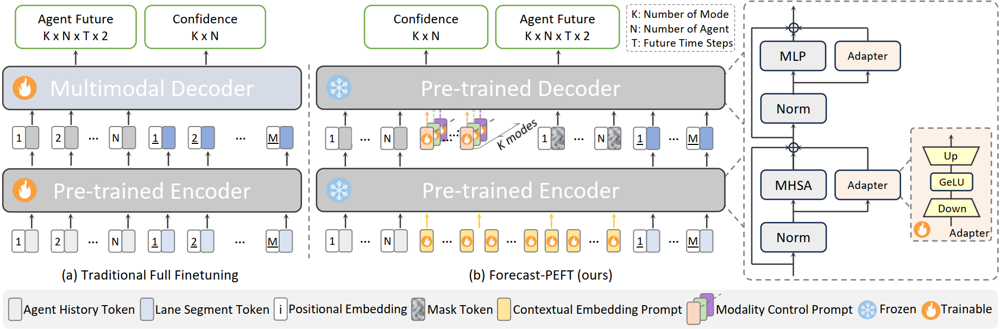

<br />
<p align="center">
  <h2 align="center">Forecast-PEFT: Parameter-Efficient Fine-Tuning for Pre-trained Motion Forecasting Models</h1>
  <p align="center">
    <strong>Jifeng Wang</strong><sup>1</sup>&nbsp;&nbsp;&nbsp;
    <strong>Kaouther Messaoud</strong><sup>2</sup>&nbsp;&nbsp;&nbsp;
    <strong>Yuejiang Liu</strong><sup>3</sup>&nbsp;&nbsp;&nbsp;
    <strong>Juergen Gall</strong><sup>1</sup>&nbsp;&nbsp;&nbsp;
    <strong>Alexandre Alahi</strong><sup>2</sup>&nbsp;&nbsp;&nbsp;
    <br />
    <sup>1</sup><strong>University of Bonn</strong>&nbsp;&nbsp;&nbsp; <sup>2</sup><strong>EPFL</strong>&nbsp;&nbsp;&nbsp; <sup>3</sup><strong> Stanford University</strong>&nbsp;&nbsp;&nbsp;
  </p>

  <p align="center">
    <a href='https://arxiv.org/pdf/2407.19564.pdf' style='padding-left: 0.5rem;'>
      
    </a>
  </p>

<p align="center">
  
</p>

## Highlight
- Our method makes full use of the pretrained encoder and decoder, with simple yet effective PEFT design. 
- Forecast-PEFT archives higher accuracy with only 17% tunable parameters. 
- Forecast-FT, our fully fine-tuned variant, demonstrates up to a 9.6% enhancement
over the baseline.

## Getting Started

- [Getting Started](#getting-started)
- [Setup Environment](#setup-environment)
- [Training](#training)
- [Citation](#citation)

## Setup Environment

1\. Clone this repository:

```
git clone https://github.com/csjfwang/Forecast-PEFT.git
cd forecast-peft
```

2\. Setup conda environment:

```
conda create -n forecast_peft python=3.8
conda activate forecast_peft
sh ./scripts/setup.sh
```

3\. Prepare [Argoverse 2 Motion Dataset](https://argoverse.github.io/user-guide/datasets/motion_forecasting.html#download): we use the same [preprocessing]((https://github.com/jchengai/forecast-mae?tab=readme-ov-file#preprocess)) as Forecast-MAE.

## Training

### 1. Pre-training (Optional, our pretrained_weights: [download](https://drive.google.com/drive/folders/10jFm8cgXtIvS-Sc5g3xnuKUd0BvOkBb8?usp=sharing))
```
python3 train.py data_root=/path/to/data_root model=model_mae gpus=4 batch_size=32
```

### 2. Finetuning: Forecast-PEFT
```
python3 train.py data_root=/path/to/data_root model=model_forecast_peft gpus=4 batch_size=32 monitor=val_minFDE6 'pretrained_weights="/path/to/pretrain_ckpt"'
```

### 3. Finetuning: Forecast-FT

```
python3 train.py data_root=/path/to/data_root model=model_forecast_ft gpus=4 batch_size=32 monitor=val_minFDE6 'pretrained_weights="/path/to/pretrain_ckpt"'
```

<!-- ### Qualitative Results

 -->

## For Citation

```bibtex
@article{Wang2024ForecastPEFTPF,
  title={Forecast-PEFT: Parameter-Efficient Fine-Tuning for Pre-trained Motion Forecasting Models},
  author={Jifeng Wang and Kaouther Messaoud and Yuejiang Liu and Juergen Gall and Alexandre Alahi},
  year={2024},
  journal={arXiv preprint arXiv:2407.19564},
}
```

This repo is developed based on [Forecast-MAE](https://github.com/jchengai/forecast-mae.git), thanks for their great work. Please also consider citing:

```bibtex
@article{cheng2023forecast,
  title={{Forecast-MAE}: Self-supervised Pre-training for Motion Forecasting with Masked Autoencoders},
  author={Cheng, Jie and Mei, Xiaodong and Liu, Ming},
  journal={Proceedings of the IEEE/CVF International Conference on Computer Vision},
  year={2023}
}
```